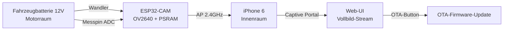

# Autofrontcam — Rechte-Seiten-Kamera für den Škoda (ESP32-CAM + OV2640)

Eine **WiFi-Seitenkamera** für ein Škoda-Fahrzeug auf Basis des **AI-Thinker ESP32-CAM**
(ESP32-D0WD-V3 + OV2640). Die Kamera liefert einen **MJPEG-Livestream** über ein eigenes
WLAN (Access Point) an ein **iPhone 6** im Fahrzeuginnenraum und unterstützt
**OTA-Firmware-Updates** über einen eingebetteten Webserver.

## Anwendungsfall

- **Montageort:** Rechte Frontseite des Škoda, vor dem Seitenspiegel, unten auf
  Reifenhöhe am Stoßfänger.
- **Zweck:** Sicht auf die **rechte Fahrzeugseite** — zur Überwachung beim Einparken,
  Rangieren und beim Beobachten des toten Winkels entlang der Fahrzeugflanke.
- **Bedienung:** Ein iPhone 6 aus dem Innenraum verbindet sich mit dem Access Point
  und wird per **Captive Portal automatisch auf die Webseite** gelenkt.

## Stromversorgung & Batterieüberwachung

- Das Modul wird über einen **Spannungswandler** an die **Fahrzeugbatterie im Motorraum**
  angeschlossen (Bordnetz 12V → 5V für das Board).
- Die **Bordspannung wird vom ESP überwacht** (Messpin am ADC des ESP32).
- **Fahrzeug abgestellt** (Spannung fällt unter den Grenzwert): Der ESP schaltet WiFi
  ab und geht in den **bestmöglichen Sleep-Modus**. Im Sleep überwacht er ausschließlich
  den Spannungs-Messpin.
- **Fahrzeug gestartet** (Spannung steigt über den Grenzwert): Der ESP **erwacht aus dem
  Sleep** und startet Access Point, Kamera und Stream neu.
- **Konfigurierbarer Grenzwert** (Werkseinstellung 12,8V), einstellbar über die Web-UI.
- **Betriebsmodus per Radiobutton** in der Web-UI: **„Dauerbetrieb“** (default) oder
  **„Geregelt“** (Sleep/Wake-up über Spannung).
- **Default = Dauerbetrieb:** Der ESP läuft **immer aktiv** — wichtig, solange der
  Spannungsteiler noch nicht montiert ist (sonst wären die Messwerte am offenen Pin
  sinnlos und der ESP würde ungewollt in den Sleep fallen). Erst nach Montage des
  Teilers wird in der UI auf **„Geregelt“** umgestellt.

## Features

- **MJPEG-Videostream** mit maximaler Bildrate (Szene so aktuell wie möglich)
- **Vollbild-Web-UI** für das Smartphone (iPhone 6), optimierte Bilddarstellung
- **Touch-Menüs**: Menüleiste nur sichtbar bei Bildschirmberührung, Ausblenden durch
  Tipp auf eine freie Stelle
- **Kalibrierungslinie (rot):** verschiebbare Fahrzeugkante — vertikal über das ganze
  Bild, links/rechts verschiebbar, Winkel einstellbar, Dicke einstellbar
- **Zweite Kalibrierungslinie (gelb):** optional, sofern der RAM reicht
- **Spannungsanzeige** der Bordspannung im Bild + einstellbarer Schwellwert
  + **Betriebsmodus** „Geregelt“/„Dauerbetrieb“ (Radiobutton, default Dauerbetrieb)
- **Access Point + Captive Portal** (iPhone 6 wird automatisch auf die Webseite gelenkt)
- **OTA-Update-Button** (links unten im Bild überlappend) – Firmware wird direkt vom
  iPhone hochgeladen (Datei aus der Files-App, kein Ausbau/Internet nötig)
- **Sleep-/Wake-up-Steuerung** über die Fahrzeugspannung
- **NVS-Konfigurationsspeicher** (WiFi, Spannungsgrenzwert, Linieneinstellungen)
- **Stack- und Heap-Monitoring**
- **ESP-IDF 6.x, FreeRTOS (Dual-Core)**

## System-Übersicht



## Sleep-/Wake-up-Logik

| Zustand | Bedingung | Verhalten |
|---|---|---|
| **Aktiv** | Spannung ≥ Grenzwert (z.B. 12,8V) | Kamera + Stream + AP laufen |
| **Sleep** | Spannung < Grenzwert | WiFi ab, Deep-/Light-Sleep, nur Spannungs-Messpin aktiv |
| **Wake-up** | Spannung > Grenzwert | Aufwachen, System komplett neu starten |
| **Dauerbetrieb** | Modus „Dauerbetrieb“ (default) | Immer aktiv, kein Sleep |

*(Konkrete Realisierung siehe Abschnitt „Design-Entscheidungen“ unten.)*

## Design-Entscheidungen (verbindliche Zielvorgaben)

> Diese Entscheidungen wurden mit dem Auftraggeber abgestimmt und sind verbindlich
> für die Implementierung. Sie dienen als „Single Source of Truth“ für das Zielbild.

### 1. Spannungsmessung
- **Messpin:** `GPIO35` (ADC1_CH7, nur Eingang — kollidiert nicht mit Kamera/PSRAM/SD).
- **Wandler (max. 14,5V):** Spannungsteiler **100kΩ (oben) / 22kΩ (unten)** →
  Teilerverhältnis 0,1803, Umrechnungsfaktor **≈5,55** (Batterie→ADC).
  Bei 14,5V ≈ 2,62V am ADC (unter der 3,1V-Grenze, 11dB), bei 12,8V ≈ 2,31V.
  Laststrom ≈0,12mA. (Nicht 30kΩ verwenden → würde bei 14,5V clippen.)
- **Messung:** Mittelwertfilter (≈16 Samples), Kalibrierungsfaktor in NVS.
- **Betriebsmodus per Radiobutton** in der Web-UI: **„Geregelt“** oder **„Dauerbetrieb“**
  (kein „0V-Trick“ am Grenzwert).
- **Default = „Dauerbetrieb“:** ESP läuft immer aktiv — gilt, bis der Spannungsteiler
  montiert ist. Erst dann auf „Geregelt“ umstellen.

### 2. Sleep-/Wake-up-Steuerung
- Nur im Modus **„Geregelt“** aktiv. Im Modus „Dauerbetrieb“ findet kein Sleep statt.
- Spannung < Grenzwert (Voreinstellung **12,8V**): WiFi + Kamera aus, **bestmöglicher Sleep**,
  nur der Messpin bleibt aktiv.
- Spannung > Grenzwert: **Aufwachen** und System neu starten (AP + Kamera + Stream).
- Da der ESP32 kein echtes ADC-Wakeup hat: Wake-up über periodisches ADC-Pollen
  im Light-Sleep (Designentscheidung, kann bei Bedarf angepasst werden).

### 3. OTA (Upload vom iPhone, „nur ein Button“)
- Der **OTA-Button** (links unten) öffnet den **Datei-Picker der Files-App**.
- Die Firmware-Datei wird per **Upload** vom iPhone direkt in die freie OTA-Partition
  geschrieben (klassischer Web-OTA, `POST /update`, raw `application/octet-stream`).
- **Wie kommt die `.bin` aufs iPhone?** Per AirDrop, iCloud/Dropbox oder Mail – danach
  steht sie in der Files-App und kann beim Update ausgewählt werden.
- Kein Ausbau des Boards, kein USB, kein Internet nötig – nur AP + iPhone.
- Im Browser wird der Upload-Fortschritt am OTA-Button angezeigt.

**Rollback-Schutz (automatischer Rückfall):**
- Aktiviert über `CONFIG_BOOTLOADER_APP_ROLLBACK_ENABLE=y`.
- Eine neue Firmware startet als **„PENDING_VERIFY“** (noch nicht bestätigt).
- In `app_main` wird nach erfolgreichem Boot `esp_ota_mark_app_valid_cancel_rollback()`
  aufgerufen (vor dem Deep-Sleep-Check!) – erst dann gilt das Update als gültig.
- **Konsequenz:**
  - *Korrupte/unvollständige Firmware* → Bootloader-Validierung schlägt fehl → startet die andere Partition.
  - *Abstürzende Firmware* (Panic vor der Bestätigung) → beim nächsten Boot rollt der
    Bootloader eigenständig auf die letzte stabile Partition zurück.
  - Hinweis: Ein logischer „Hänger“ ohne Reset wird nicht erkannt (Watchdogs bewusst
    deaktiviert für Kamera/Stream).

**OTA-Ablauf:**
```
idf.py build  →  build/autofrontcam.bin
      ↓ (AirDrop/iCloud/Mail)
autofrontcam.bin in der Files-App des iPhones
      ↓
Web-UI: OTA-Button → Datei auswählen → Upload → Neustart
```

### 4. Web-UI (iPhone 6, Touch)
- **Vollbild-Stream**, Bild bestmöglich ausgenutzt.
- **Immer sichtbar:** Stream, Kalibrierungslinien (Overlay), Spannungsanzeige.
- **Touch-Menü (nur nach Bildschirm-Berührung):** Linien-Buttons, Dicke, OTA-Button,
  Spannungsgrenzwert + **Betriebsmodus (Radiobutton „Geregelt“/„Dauerbetrieb“)**.
  Ausblenden durch Tipp auf freie Stelle.
- **OTA-Button:** links unten, überlappend auf dem Bild.
- **Spannungsanzeige:** rechts oben (z.B. `12,9V`); Grenzwert-Einstellung nur im
  Modus „Geregelt“ relevant.

### 5. Kalibrierungslinien (Overlay)
- **Canvas-Overlay** über dem Stream (`/stream`), Linien werden darauf gezeichnet.
- **Rote Linie** = Fahrzeugkante: immer vertikal über das ganze Bild, X-Position
  (links/rechts), **Winkel** um den Mittelpunkt, **Dicke** — alles einstellbar.
- **Gelbe Linie:** zweite Linie, aktivierbar, sofern der RAM reicht.
- **Bedienung = Drag + Buttons:**
  - *Drag auf der Linie* → X-Position verschieben; *Griff oben/unten* → Winkel drehen.
  - *4 Buttons* (links eingeblendet): `←` `→` (fein verschieben) + `↺` `↻` (fein drehen).
  - Drag nur aktiv bei geöffnetem Menü (normales Tippen verschiebt nichts).
- **Persistenz:** X, Winkel, Dicke, aktive Linien in **NVS** (überleben Sleep/Neustart).

### 6. Stream
- **Maximale Bildrate** — die Szene soll so aktuell wie möglich sein
  (Auflösung/Qualität/Puffergröße entsprechend trimmen).

## Zugriff

- **AP-Modus:** SSID `Cam-AP`, IP `10.1.1.1` → Captive Portal öffnet die Web-UI automatisch
- **Stream:** `http://<ip>:81/stream`
- **Einzelbild:** `http://<ip>:81/capture`
- **OTA:** `http://<ip>:80/ota`

## Board: AI-Thinker ESP32-CAM

| Komponente | Spezifikation |
|---|---|
| **Chip** | ESP32-D0WD-V3 (Dual-Core Xtensa LX6, 240MHz) |
| **Kamera** | OV2640 (SCCB/I2C, DVP parallel) |
| **Flash** | 4MB (aus Chip ausgelesen) |
| **PSRAM** | 4MB (SPI-RAM, wichtig für JPEG-Puffer) |
| **Status-LED** | GPIO33 (active-low) |
| **Flash-LED** | GPIO4 |
| **Port** | COM4 (USB-Serial CH340) |
| **Spannungsmessung** | ADC an einem frei konfigurierbaren GPIO (Spannungsteiler 12V→3,3V) |

## Schnellstart

### Build
```powershell
. ..\lora\activate-esp-idf.ps1   # ESP-IDF Umgebung aktivieren
idf.py build
```

### Flash (initial)
```powershell
idf.py -p COM4 flash
```

### OTA Flash (nach erstem Flash)
```powershell
idf.py build
idf.py -p COM4 flash
```

### Monitor
```powershell
idf.py -p COM4 monitor
```

## Projektstruktur

```
autofrontcam/
├── components/
│   ├── main/                 Quellcode
│   │   ├── main.c            Hauptprogramm (Stream-Server, Web-UI, Config-API)
│   │   ├── index.html        Eingebettete Touch-Web-UI (Stream + Overlay-Linien)
│   │   ├── camera.c          OV2640 Kameratreiber
│   │   ├── wifi.c            WiFi-Manager (AP + Captive Portal)
│   │   ├── ota.c             OTA-Webserver (Upload)
│   │   ├── nvs_config.c      NVS-Konfigurationsspeicher
│   │   ├── voltage.c         Spannungsmessung (ADC GPIO35)
│   │   ├── sleep.c           Sleep-/Wake-up-Steuerung (Deep-Sleep)
│   │   ├── lines.c           Kalibrierungslinien (NVS-Persistenz)
│   │   ├── stack_monitor.c   Stack-Ueberwachung
│   │   └── heap_monitor.c    Heap-Ueberwachung
│   └── esp_hal_clock/        Lokale Komponente (fehlt in IDF v6.1-dev)
├── include/                  Header
│   ├── config.h              Hardware-Konfiguration (ESP32-CAM)
│   ├── camera.h              Kamera-API
│   ├── wifi.h                WiFi-API
│   ├── ota.h                 OTA-API
│   ├── nvs_config.h          NVS-API
│   ├── voltage.h             Spannungsmessung-API
│   ├── sleep.h               Sleep-API
│   └── lines.h               Linien-API
├── CMakeLists.txt            ESP-IDF Projekt
├── sdkconfig.defaults        Board-Konfiguration (4MB, PSRAM)
├── partitions.csv            OTA-Partitionen (4MB)
├── tools/
│   └── increment_build.py    Build-Nummer erhöhen
└── components/main/idf_component.yml   Abhängigkeiten (esp32-camera)
```

## Konfiguration

Alle wichtigen Parameter in `include/config.h`:
- **Kamera-Pins (OV2640)** und Auflösung (SVGA 800x600, JPEG)
- **LED-Pins** (Status + Blitz)
- **WiFi-AP-SSID, AP-IP, Timeouts**
- **OTA-Port, mDNS-Hostname**
- **Spannungsmesspin + Spannungsteiler-Faktor**
- **Sleep-Grenzwert (Voreinstellung 12,8V)**
- **Task-Stacks und Prioritaeten**

## Implementierungsstatus

| Feature | Status |
|---|---|
| MJPEG-Stream + Einzelbild (max. Bildrate, GRAB_LATEST) | ✅ implementiert |
| Web-UI (Vollbild, Touch-Menü) | ✅ implementiert |
| Access Point + Captive Portal | ✅ implementiert |
| OTA (Upload vom iPhone, Button links unten) | ✅ implementiert |
| mDNS | ✅ implementiert |
| Spannungsmessung (ADC GPIO35, Teiler 5,55) | ✅ implementiert |
| Sleep-/Wake-up-Steuerung (Deep-Sleep, Timer-Wakeup) | ✅ implementiert |
| Kalibrierungslinien (rot + gelb, Drag + Buttons) | ✅ implementiert |
| Spannungsanzeige + Modus/Grenzwert (Radiobutton) | ✅ implementiert |
| NVS-Persistenz (Linien, Modus, Grenzwert) | ✅ implementiert |

## Abhängigkeiten

- **`espressif/esp32-camera`** (v2.1.7) — OV2640-Treiber, via Component Registry
- **`espressif/esp_jpeg`** — JPEG-Verarbeitung
- **`esp_hal_clock`** — lokale Komponente, da sie in der verwendeten IDF v6.1-dev-Installation fehlt (aus IDF v6.0 übernommen)

## Versionierung

`MAJOR.MINOR.BUILD` in `include/config.h` (`APP_VERSION_MAJOR`, `APP_VERSION_MINOR`).
